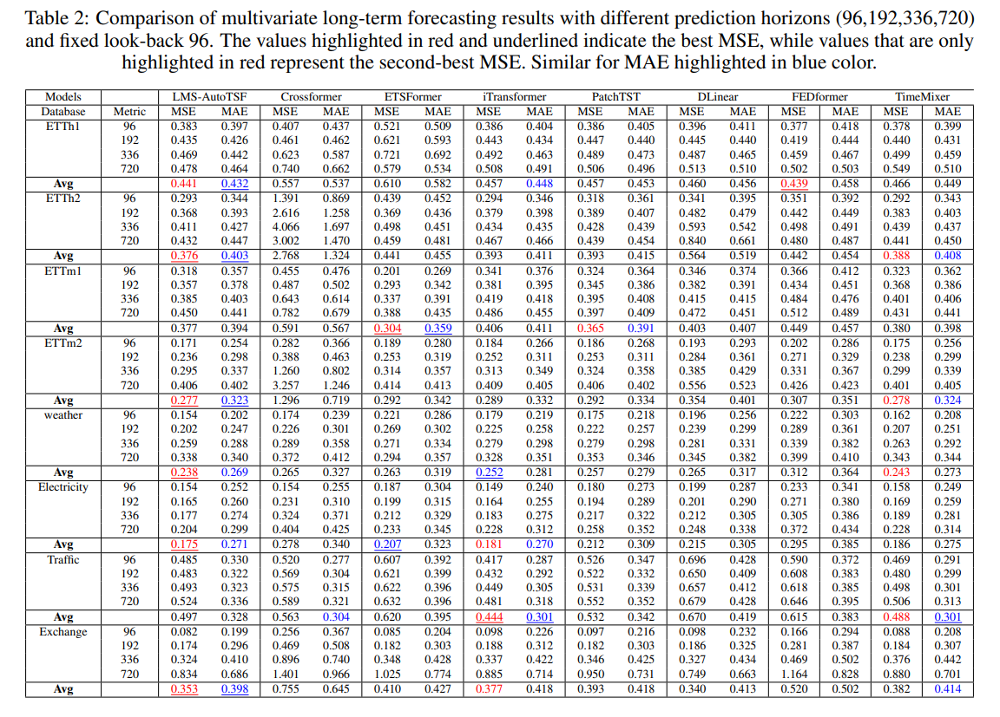

# Learnable Multi-Scale Decomposition and Integrated Autocorrelation for Time Series Forecasting

[LMS-AUTOTSF](https://arxiv.org/pdf/2412.06866)

```
article{delibasoglu2024lms,
  title={LMS-AutoTSF: Learnable Multi-Scale Decomposition and Integrated Autocorrelation for Time Series Forecasting},
  author={Delibasoglu, Ibrahim and Chakraborty, Sanjay and Heintz, Fredrik},
  journal={arXiv preprint arXiv:2412.06866},
  year={2024}
}
```

# Results

Performanced comparison on public benchmark datasets




# Acknowledgement
We appreciate the following GitHub repositories:

https://github.com/thuml/Time-Series-Library
