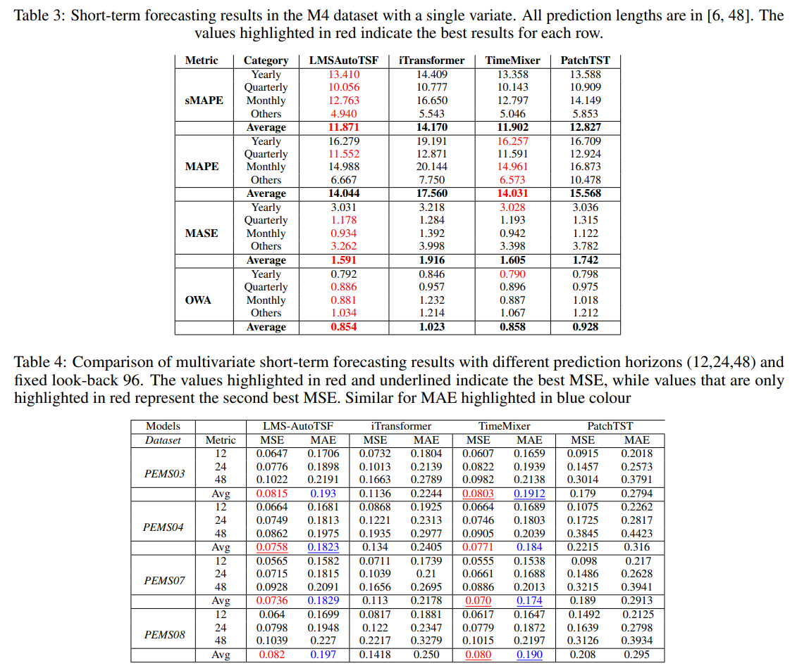

# LEARNABLE MULTI-SCALE DECOMPOSITION AND INTEGRATED AUTOCORRELATION FOR TIME SERIES FORECASTING

[LMS-AUTOTSF](https://arxiv.org/pdf/2412.06866)


```
@article{ibrahim2024LMSTSF,
  title={LMS-AutoTSF: Learnable Multi-Scale Decomposition and Integrated Autocorrelation for Time Series Forecasting},
  author=Ibrahim Delibasoglu Sanjay Chakraborty Fredrik Heintz},
  journal={arXiv preprint arXiv:2412.06866},
  year={2024}
}
```

# Results

Performanced comparison on public benchmark datasets


