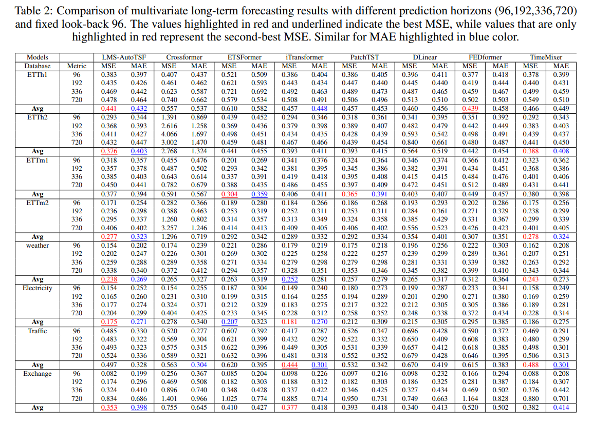
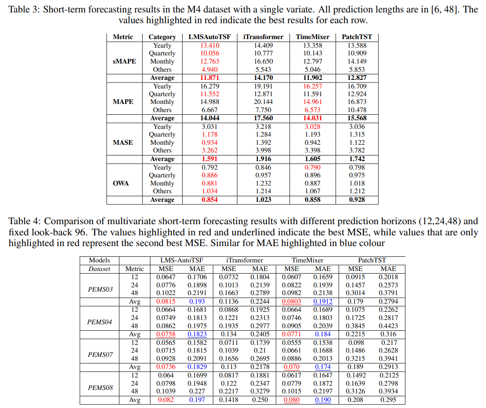

# Learnable Multi-Scale Decomposition and Integrated Autocorrelation for Time Series Forecasting

 We improved the preprint study by adding confidence-aware forecasting option. Cite both of the paper if you use [LMSAutoTSF](models/LMSAutoTSF.py) or [LMSAutoTSFV2](models/LMSAutoTSFV2.py).

[EAAI paper](https://www.sciencedirect.com/science/article/pii/S0952197626017331)

```
@article{delibasoglu2026learnable,
  title={Learnable multi-scale decomposition with integrated autocorrelation and confidence-aware time series forecasting},
  author={Delibasoglu, Ibrahim and Chakraborty, Sanjay and Heintz, Fredrik},
  journal={Engineering Applications of Artificial Intelligence},
  volume={181},
  pages={115449},
  year={2026},
  publisher={Elsevier}
}
```

[Arxiv paper](https://arxiv.org/pdf/2412.06866)

```
article{delibasoglu2024lms,
  title={LMS-AutoTSF: Learnable Multi-Scale Decomposition and Integrated Autocorrelation for Time Series Forecasting},
  author={Delibasoglu, Ibrahim and Chakraborty, Sanjay and Heintz, Fredrik},
  journal={arXiv preprint arXiv:2412.06866},
  year={2024}
}
```

# Learning Temporal Saliency for Time Series Forecasting with Cross-Scale Attention

[CrossScaleNet](https://arxiv.org/abs/2509.22839)

```
@article{delibasoglu2025learning,
  title={Learning Temporal Saliency for Time Series Forecasting with Cross-Scale Attention},
  author={Delibasoglu, Ibrahim and Heintz, Fredrik},
  journal={arXiv preprint arXiv:2509.22839},
  year={2025}
}
```

# Results

Performanced comparison on public benchmark datasets






# Acknowledgement
We appreciate the following GitHub repositories:

https://github.com/thuml/Time-Series-Library
